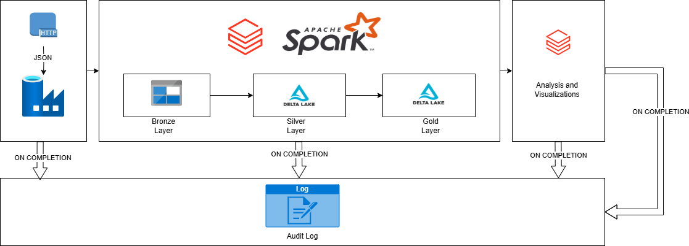

# Technical Design Document

## 1. Objectives
The goal of this project is to develop a robust data pipeline that extracts, transforms, and visualizes data. The solution utilizes:
- **Azure Data Factory** for data ingestion
- **Databricks with PySpark** for data transformation
- **Spark SQL** for analysis
- **Power BI** for visualization

---

## 2. Project Architecture Diagram

---

## 3. Project Architecture Overview
The project adopts a **Medallion Architecture** with bronze, silver, and gold data layers. This model organizes data into distinct layers based on their level of processing and refinement.

### 3.1. Data Ingestion (Bronze Layer):
- **Source**: Raw data (JSON file)
- **Ingestion Tool**: Azure Data Factory
- **Storage**: Azure Data Lake Storage Gen2

### 3.2. Data Transformation (Silver Layer):
- **Processing Tool**: Azure Databricks with PySpark
- **Storage**: Delta Lake tables

### 3.3. Data Refinement (Gold Layer):
- **Final Dataset**: Refined, analytical data stored in Delta Lake tables

### 3.4. Data Analysis & Visualization:
- **Tools for Analysis**: Databricks (SQL queries)
- **Visualization Tool**: Databricks visualizations

---

## 4. Implementation Plan

### 4.1. Data Ingestion and Storage
- Identify the raw data sources (JOSN file in HTTP Source).
- Set up an Azure Data Factory pipeline for ingestion.
  - Configure Copy Activity to transfer data from source system to Azure Data Lake Storage Gen2.

### 4.2. Data Extraction
- Convert raw JSON data into a structured format suitable for transformations and analysis.
- Save the extracted data as Parquet files in ADLS Gen2.

### 4.3. Data Transformation and Cleaning
- Establish an Azure Databricks workspace.
- Use PySpark to clean and transform the data.
- Apply possible performance optimization techniques:
  - **Caching**
  - **Partitioning**
  - **Indexing**
- Store the transformed data in Delta Lake tables for efficient querying and updates.

### 4.4. Data Analysis and Visualization
- Prepare transformed data for analysis with additional cleaning or transformations.
- Use Databricks notebooks for SQL-based analysis.
- Create interactive dashboards and reports using Databricks visualizations.

---

## 5. Tools and Services

| **Process**         | **Tools/Services**                |
|----------------------|-----------------------------------|
| Data Ingestion       | Azure Data Factory               |
| Data Storage         | Azure Data Lake, Azure Delta Tables |
| Data Transformation  | Databricks, PySpark              |
| Data Analytics       | Spark SQL                        |
| Data Visualization   | Power BI                         |

---

## 6. Schema Design

### Raw Data Schema (Bronze Layer)
| **Column**    | **Data Type** | **Description**                           |
|---------------|---------------|-------------------------------------------|
| id            | STRING        | Unique identifier for each restaurant.    |
| name          | STRING        | Restaurant name.                         |
| city          | STRING        | City where the restaurant is located.    |
| rating        | DOUBLE        | Restaurant rating.                       |
| rating_count  | STRING        | Number of people who rated.              |
| cost          | DOUBLE        | Cost per person.                         |
| cuisine       | STRING        | Types of cuisines offered.               |
| lic_no        | STRING        | License number.                          |
| address       | STRING        | Full address of the restaurant.          |
| menu          | STRING        | Menu details of each restaurant.         |
| link          | STRING        | Restaurant URLs.                         |

### Transformed Data Schema (Silver/Gold Layer)
| **Column**      | **Data Type** | **Description**                           |
|------------------|---------------|-------------------------------------------|
| Restaurant_ID    | STRING        | Unique identifier for each restaurant.    |
| Name             | STRING        | Restaurant name.                         |
| City             | STRING        | City where the restaurant is located.    |
| Cuisine          | STRING        | Comma-separated cuisines served.         |
| Rating           | DOUBLE        | Numeric rating.                          |
| Rating_Count     | INT           | Number of ratings derived from string.   |
| Lic_no           | STRING        | License number.                          |
| Cost             | DOUBLE        | Average cost per person.                 |
| Address          | STRING        | Full address of the restaurant.          |
| TimeStamp        | DATETIME      | Data inserted timestamp.                 |

### Audit Table Schema
| **Column**      | **Data Type** | **Description**                           |
|------------------|---------------|-------------------------------------------|
| Id              | STRING        | Unique ID for the pipeline execution.    |
| Process_Id      | STRING        | Unique ID for the specific process.      |
| Process_Name    | STRING        | Name of the process.                     |
| Start_Time      | TIMESTAMP     | Pipeline execution start time.           |
| End_Time        | TIMESTAMP     | Pipeline execution end time.             |
| Status          | STRING        | Pipeline execution status (Success/Failure). |
| Message         | STRING        | Log messages, if any.                    |

---
